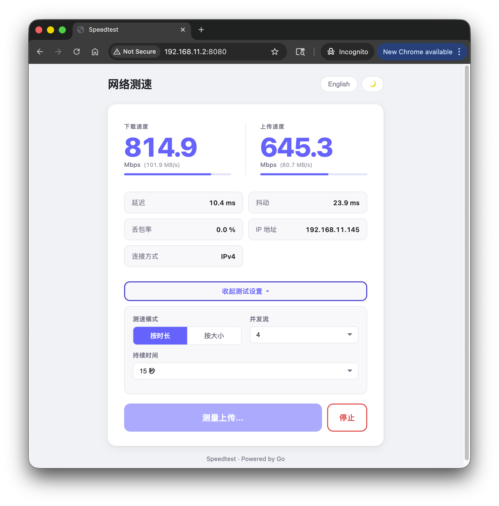

# ⚡ Speedtest-Go

> 单二进制文件部署的自托管网络测速站点，无外部依赖，零配置即可运行。

<p align="center">
  
</p>

<p align="center">
  <a href="https://github.com/chancelyg/speedtest-go/releases/latest"></a>
  <a href="LICENSE"></a>
  <a href="https://github.com/chancelyg/speedtest-go/actions/workflows/release.yml"></a>
  
</p>

---

## ✨ 功能特性

- 📊 **全面测速**：下载速度、上传速度、延迟、抖动、丢包率一次测完
- ⏱️ **双测速模式**：按时长（time）或按数据量（size）自由切换
- 🌐 **多语言**：中文 / English 一键切换，偏好持久化存储
- 🌙 **自适应主题**：自动跟随系统暗色/亮色偏好，支持手动覆盖
- 🚀 **单二进制部署**：前端资源通过 `embed` 内嵌，零外部依赖
- 🔀 **多流并发**：支持 1–16 条并发流，准确测量高带宽链路
- ⏹️ **随时停止**：测速过程中可随时中止，无需等待完成
- 🔒 **安全加固**：并发限制、请求体大小上限、可信代理头校验、优雅关闭
- 📦 **跨平台发布**：GoReleaser 自动构建 Linux / macOS / Windows 多平台二进制

---

## 🚀 快速开始

### 使用预编译二进制（推荐）

前往 [Releases](https://github.com/chancelyg/speedtest-go/releases/latest) 下载对应平台的压缩包，解压后直接运行：

```bash
# Linux / macOS
./speedtest

# 访问 http://localhost:8080
```

### 从源码运行

```bash
git clone https://github.com/chancelyg/speedtest-go.git
cd speedtest-go

# 开发运行
go run main.go

# 构建当前平台二进制
go build -o speedtest .
```

---

## ⚙️ 配置

所有配置均通过环境变量设置，无需配置文件：

| 环境变量 | 默认值 | 说明 |
|---------|--------|------|
| `SPEEDTEST_HOST` | `0.0.0.0` | 绑定地址 |
| `SPEEDTEST_PORT` | `8080` | 监听端口 |
| `SPEEDTEST_MODE` | `time` | 测速模式：`size` 或 `time` |
| `SPEEDTEST_DURATION` | `15` | 时长模式持续时间（秒） |
| `SPEEDTEST_DOWNLOAD_SIZE` | `25` | 大小模式下载量（MB） |
| `SPEEDTEST_UPLOAD_SIZE` | `10` | 大小模式上传量（MB） |
| `SPEEDTEST_STREAMS` | `4` | 并发流数量 |
| `SPEEDTEST_MAX_CONCURRENT` | `10` | 最大并发测速数 |

```bash
# 示例：30 秒时长模式，8 条并发流
SPEEDTEST_PORT=3000 SPEEDTEST_DURATION=30 SPEEDTEST_STREAMS=8 ./speedtest
```

---

## 🌐 API 端点

| 端点 | 方法 | 功能 |
|------|------|------|
| `/` | GET | 前端测速页面 |
| `/api/config` | GET | 获取服务器测速配置 |
| `/api/ip` | GET | 获取客户端 IP 地址 |
| `/api/ping` | GET | 延迟探测 |
| `/api/download` | GET | 下载测速数据流（支持 `?duration=N` / `?bytes=N`） |
| `/api/upload` | POST | 上传测速数据接收 |

---

## 🏗️ 项目结构

```
speedtest-go/
├── main.go                    # 程序入口，HTTP 服务 + 优雅关闭
├── go.mod
├── .goreleaser.yaml           # GoReleaser 构建配置
├── .github/workflows/
│   └── release.yml            # 推送 tag 自动发布 GitHub Release
├── static/                    # 前端资源（embed 内嵌到二进制）
│   ├── index.html
│   ├── style.css
│   └── app.js
├── internal/
│   ├── config/                # 环境变量配置
│   └── handler/               # HTTP 处理器
└── docs/                      # 详细文档 & 截图
```

---

## 🧪 测试

```bash
go test ./...          # 单元测试
go test -cover ./...   # 覆盖率报告
```

---

## 🐳 部署

### Docker

```dockerfile
FROM gcr.io/distroless/static-debian12
COPY speedtest /speedtest
EXPOSE 8080
ENTRYPOINT ["/speedtest"]
```

```bash
docker build -t speedtest-go .
docker run -d -p 8080:8080 speedtest-go
```

### Systemd

```ini
[Unit]
Description=Speedtest Server
After=network.target

[Service]
ExecStart=/usr/local/bin/speedtest
Restart=always
Environment="SPEEDTEST_PORT=8080"

[Install]
WantedBy=multi-user.target
```

---

## 📚 详细文档

- [使用说明](docs/usage.md)
- [API 文档](docs/api.md)
- [配置说明](docs/configuration.md)
- [部署指南](docs/deployment.md)
- [架构说明](docs/architecture.md)

---

## 📄 License

[MIT](LICENSE) © chancelyg
